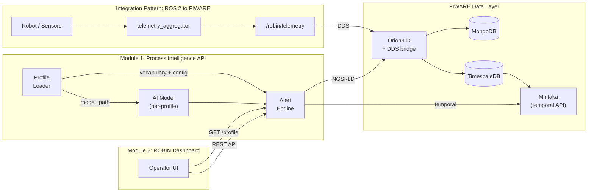
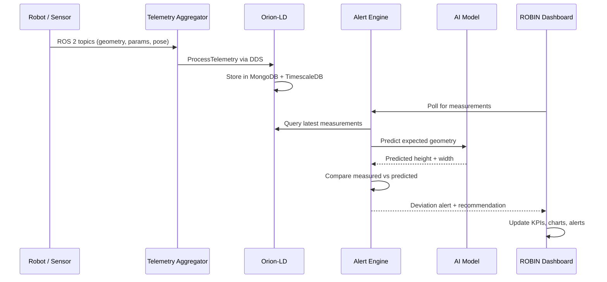
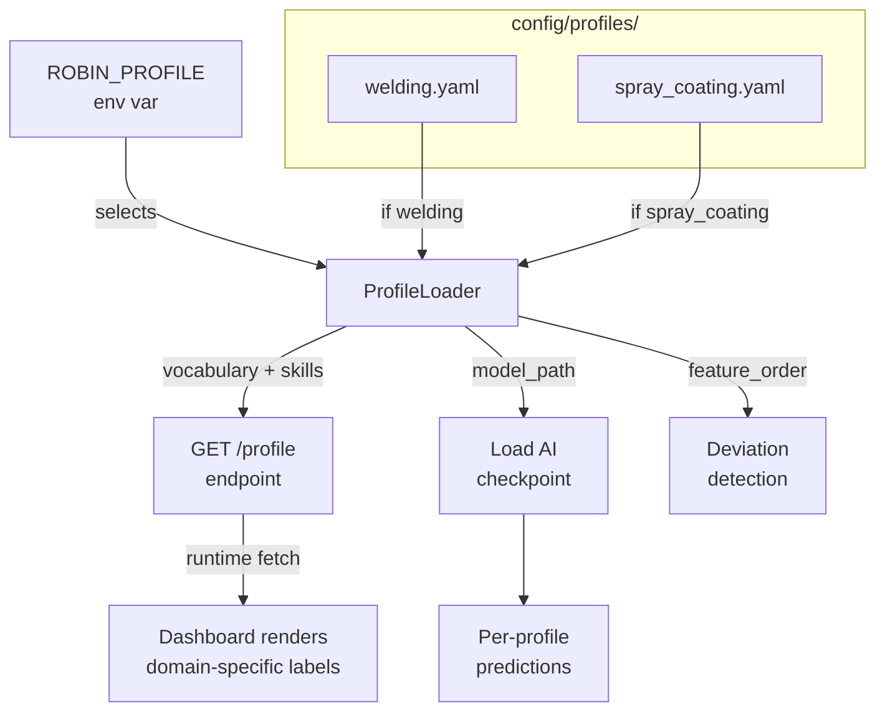

# ROBIN - Reusable Building Blocks for Robotic Process Intelligence

ROBIN provides **two open-source modules** and a **documented integration pattern** for monitoring, quality control, and AI-assisted optimization of robotic manufacturing processes. The components are domain-agnostic: they work for welding, spray coating, machining, or any process where a robot produces measurable outputs that you want to track, alert on, and improve with AI.

This repository ships the modules together with integration examples and demo profiles that show them in action across different industrial domains.

## Modules

### Module 1 - Process Intelligence API (`robin/`)

A FastAPI service for process lifecycle management, deviation detection, and AI-assisted recommendations over FIWARE/NGSI-LD data.

| | |
|---|---|
| **Depends on** | Orion-LD context broker (any FIWARE deployment) |
| **Provides** | REST API: create processes, ingest measurements, check deviations, serve AI recommendations |
| **Deploy** | `docker run` (see `robin/Dockerfile`) or `pip install` from source |
| **Docs** | [`robin/README.md`](robin/README.md) |

### Module 2 - Monitoring Dashboard (`robin-dashboard`)

A React operator dashboard for live process monitoring, deviation alerts, AI model management, and 3D visualization. All domain labels are configurable via environment variables - no code changes needed to switch domains.

| | |
|---|---|
| **Depends on** | Module 1 (Process Intelligence API) |
| **Provides** | Browser UI: KPIs, telemetry charts, deviation monitor, AI trust management, history CSV export (raw data + warnings) |
| **Deploy** | `docker run` (see `robin-dashboard/Dockerfile`) |
| **Configure** | `VITE_TERM_*` environment variables (see [`domain vocabulary`](#domain-vocabulary)) |
| **Docs** | [`robin-dashboard/README.md`](robin-dashboard/README.md) |

## Integration Pattern - ROS 2 to FIWARE via DDS

For robotic processes that use ROS 2, the repository documents a proven pattern for
getting telemetry data into FIWARE without custom bridge code:

1. A **telemetry aggregator node** (`vulcanexus_ws/src/robin_core_data/`) subscribes to
   your robot/sensor topics and publishes a normalized `ProcessTelemetry` message.
2. **Orion-LD's built-in DDS bridge** (started with the `-dds` flag) picks up the
   message and writes it into FIWARE as an NGSI-LD entity automatically.
3. A **DDS mapping config** (`config-dds.json`) tells Orion which DDS topic maps to
   which entity type.

This is not a standalone module - the heavy lifting is done by Orion-LD itself. What
ROBIN contributes is the aggregator node, the message schema, a TimescaleDB trigger
for correct temporal indexing, and documentation of how to wire it all together.

Modules 1 and 2 work without this pattern - you can feed data through the CLI or
REST API instead of ROS 2.

Details: [`vulcanexus_ws/src/robin_core_data/README.md`](vulcanexus_ws/src/robin_core_data/README.md).

## How the Components Fit Together



### Data Flow: Measurement to Alert



### Profile Switching



## Integration Example

`docker-compose.yaml` shows how to compose the modules and integration pattern with
FIWARE into a complete stack:

```bash
docker compose up -d        # start FIWARE + both modules + ROS 2 container
./demo/validate-setup.sh    # verify everything is healthy
```

This is an **example integration**, not part of the modules themselves. You can deploy
each module independently in your own infrastructure.

## Demo Profiles

The `demo/` directory contains example applications that exercise the modules across
different industrial domains:

| Profile | Domain | Quick start |
|---|---|---|
| Welding (reference) | Robotic wire-arc welding | `python demo/profiles/welding_profile.py` |
| Spray Coating | Robotic protective coating | `python demo/profiles/spray_coating_profile.py` |

Each profile maps its domain terms onto the same process data model:

| Core field | Role | Welding | Spray Coating |
|---|---|---|---|
| `measuredHeight` | Primary geometry output | Bead Height | Coating Thickness |
| `measuredWidth` | Secondary geometry output | Bead Width | Coverage Width |
| `measuredSpeed` | Process speed | Wire Speed | Line Speed |
| `measuredCurrent` | Primary process input | Welding Current | Flow Rate |
| `measuredVoltage` | Secondary process input | Arc Voltage | Nozzle Pressure |

Full demo guide: [`demo/README.md`](demo/README.md).
Profile comparison and how to add your own: [`demo/profiles/README.md`](demo/profiles/README.md).

## Profile Configuration

Each domain is defined by a single YAML file in `config/profiles/`. Switch profiles
by setting one environment variable - no rebuild required:

```bash
# Default: welding
docker compose up -d

# Switch to spray coating
ROBIN_PROFILE=spray_coating docker compose up -d
```

A profile YAML contains vocabulary (dashboard labels), ROS 2 topic mappings,
robot skills (ros4hri-inspired), AI model config, and DDS bridge settings.
The dashboard fetches the active profile from the API at startup.

Example profile files: [`config/profiles/`](config/profiles/).
Full schema and how to add your own: [`demo/profiles/README.md`](demo/profiles/README.md).

## Quick Start

```bash
git clone https://github.com/Industry40Lab/open-robin.git
cd open-robin
poetry install --with dev

docker compose up -d
./demo/validate-setup.sh

# Run the canonical welding demo (dual mode)
python demo/profiles/welding_profile.py --mode both --duration 120 --interval 2

# Run the canonical spray demo (dual mode)
ROBIN_PROFILE=spray_coating docker compose up -d
python demo/profiles/spray_coating_profile.py --mode both --duration 120 --interval 2
```

## Rebuild + Verify Live Telemetry (Explicit)

Use this checklist after changing backend/frontend code to ensure the running UI
is using the latest containers and plotting real Mintaka-stored data.

1. Rebuild and recreate the two user-facing services:

```bash
docker compose build alert-processor robin-dashboard
docker compose up -d --force-recreate alert-processor robin-dashboard
docker compose ps alert-processor robin-dashboard
```

2. Run a short dual-mode welding demo (non-interactive):

```bash
BASE="verify-$(date +%s)"
python demo/profiles/welding_profile.py \
  --process-id "$BASE" \
  --mode both \
  --duration 60 \
  --interval 1 \
  --no-prompt
```

3. Open the dashboard and verify UI behavior:

* URL: `http://localhost:5174`
* In top bar process selector, choose:
  * `${BASE}-parameter`
  * `${BASE}-geometry`
* In **Live Ops -> Telemetry** confirm:
  * data-source chip shows **`Mintaka stored data`**
  * poll chip shows **`Poll 1s`** (Active Run) or **`Poll 2s`** (Demo Mode)
  * chart updates continuously at that cadence

4. Verify data integrity from API (must report Mintaka source):

```bash
curl -s "http://localhost:8001/process/${BASE}-parameter/measurements?last=5" | jq '.debug_info.source, .measurements'
```

Expected: first output line is `"mintaka"`.

5. Optional raw Mintaka cross-check (same timestamps/values as API):

```bash
curl -s "http://localhost:9090/temporal/entities/urn:ngsi-ld:Process:${BASE}-parameter?attrs=measuredHeight,measuredWidth,measuredSpeed,measuredCurrent,measuredVoltage&timeproperty=observedAt&timerel=between&timeAt=1970-01-01T00:00:00Z&endTimeAt=2035-01-01T00:00:00Z&options=temporalValues&lastN=5" | jq
```

## What's in this Repository

```
robin/                          MODULE 1: Process Intelligence API
robin-dashboard/               MODULE 2: Monitoring Dashboard

vulcanexus_ws/src/
  robin_interfaces/             Integration pattern: generic telemetry message types
  robin_core_data/              Integration pattern: telemetry aggregator node
config-dds.json                 Integration pattern: DDS → FIWARE mapping template

config/profiles/                Profile configs (one YAML per domain)
  welding.yaml                    Welding (default)
  spray_coating.yaml              Spray coating

docker-compose.yaml             Integration example (FIWARE + modules + ROS 2)
demo/                           Example applications (welding and spray coating)

vulcanexus_ws/src/
  robin_hardware_fronius/       Example domain adapter: Fronius welding machine
  robin_hardware_garmo/         Example domain adapter: Garmo laser profilometer
  robin_simulation/             Example domain adapter: welding process simulator
```

## Documentation

Full Sphinx documentation (user guide, API reference, architecture, demos):

```bash
poetry install --with docs
poetry run sphinx-build -b html docs docs/_build/html
```

Then open `docs/_build/html/index.html` in your browser. For a clean rebuild: `poetry run sphinx-build -E -a -b html docs docs/_build/html`.

The docs are also configured for [Read the Docs](https://readthedocs.org/) via `.readthedocs.yaml`.

## ARISE Publication

This repository is structured for ARISE catalog onboarding:

- Catalog metadata: `arise/catalog-metadata.yaml`
- Publication roadmap: `ARISE_PUBLICATION_ROADMAP.md`
- Submission checklist: `ARISE_PUBLICATION_CHECKLIST.md`

## Quality Evidence

```bash
poetry run pytest -q                          # Backend tests
cd robin-dashboard && npm ci && npm run build  # Frontend build
```

CI pipeline: `.github/workflows/ci.yml`

## License

MIT. See `LICENSE`.

## Support

- Issues: https://github.com/Industry40Lab/open-robin/issues
- Discussions: https://github.com/Industry40Lab/open-robin/discussions
