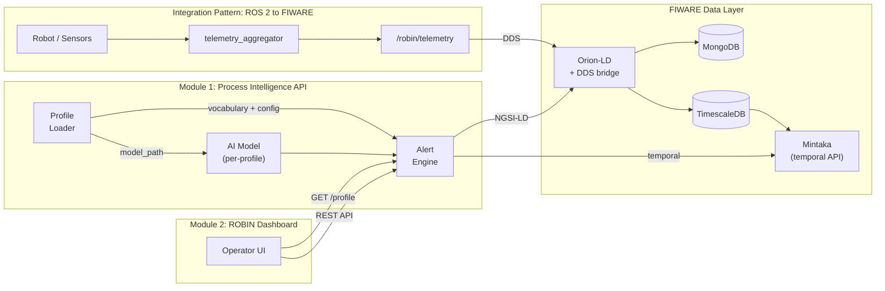
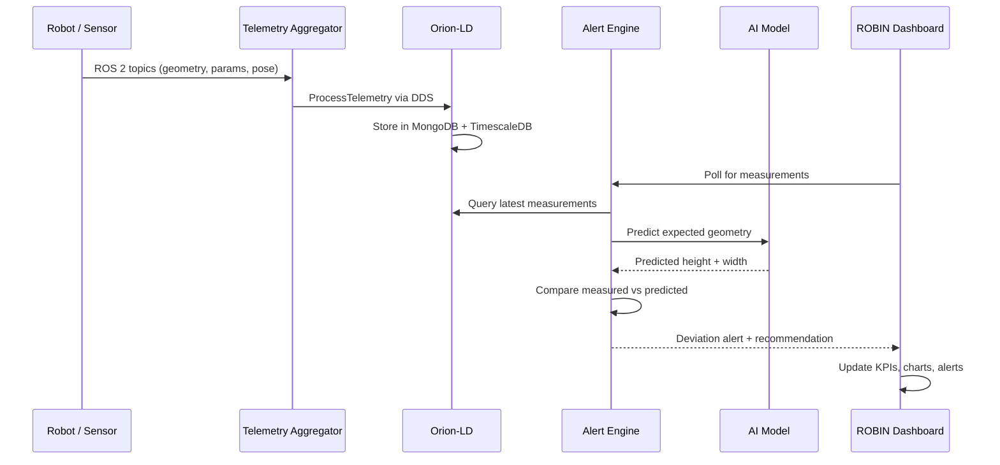
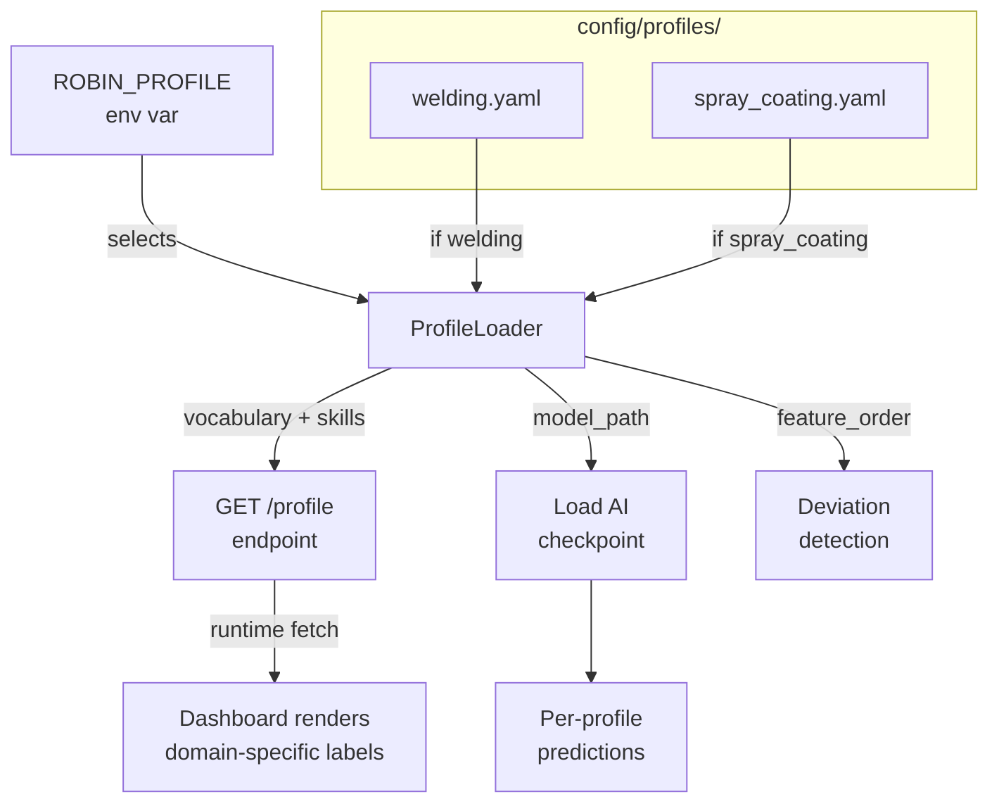

# ROBIN - Reusable Building Blocks for Robotic Process Intelligence
[](https://codecov.io/gh/3D-Components/open-robin)
[](https://codecov.io/gh/3D-Components/open-robin)
[](https://github.com/3D-Components/open-robin/actions/workflows/ci.yml?query=branch%3Amain)
[](https://open-robin.readthedocs.io/en/latest/?badge=latest)
[](https://github.com/3D-Components/open-robin/blob/main/LICENSE)
[](https://www.python.org/downloads/)
[](https://docs.ros.org/en/jazzy/)
[](https://fastapi.tiangolo.com/)
[](https://www.fiware.org/)

ROBIN provides **two open-source modules** and a **documented integration pattern** for monitoring, quality control, and AI-assisted optimization of robotic manufacturing processes. The components are domain-agnostic: they work for welding, spray coating, machining, or any process where a robot produces measurable outputs that you want to track, alert on, and improve with AI.

This repository ships the modules together with integration examples and demo
profiles that show them in action across different industrial domains.

The open/reusable module boundary is documented in
[`docs/open_boundary.rst`](docs/open_boundary.rst). In short, `open-robin` is
the reusable process-intelligence module; the welding setup is a reference
demonstrator and not the definition of the module scope.

## AI Training Scope (Open vs Private)

ROBIN's open-source scope is centered on **telemetry intelligence and model
consumption at runtime**. Real-data ingestion/cleaning and production retraining
pipelines are deployment-specific and should live in a private MLOps repository.

- Open-source side: model interfaces, profile contracts, synthetic/mock training
  flows for demos, and validation tooling.
- Private side: raw proprietary datasets, source-specific extraction logic,
  production cleaning heuristics, and retraining orchestration.
- This repository may keep small, commit-worthy AI artifacts needed for runtime
  integration, such as a selected checkpoint, its scaler, and a benchmark
  summary. Raw datasets, intermediate exports, large investigations, and most
  training outputs should stay outside the repository.

Repository boundary notes for committed artifacts are under [`data/README.md`](data/README.md).

## Modules

### Module 1 - Process Intelligence API (`robin/`)

A FastAPI service for process lifecycle management, deviation detection, and
AI-assisted recommendations over FIWARE/NGSI-LD data.

| | |
|---|---|
| **Depends on** | Orion-LD context broker (any FIWARE deployment) |
| **Provides** | REST API: create processes, ingest measurements, check deviations, serve AI recommendations |
| **Deploy** | `docker run` (see `robin/Dockerfile`) or `pip install` from source |
| **Docs** | [`robin/README.md`](robin/README.md) |

### Module 2 - Monitoring Dashboard (`robin-dashboard`)

A React operator dashboard for live process monitoring, deviation alerts, AI
model management, and 3D visualization. All domain labels are configurable via
environment variables - no code changes needed to switch domains.

| | |
|---|---|
| **Depends on** | Module 1 (Process Intelligence API) |
| **Provides** | Browser UI: KPIs, telemetry charts, deviation monitor, AI trust management, history CSV export (raw data + warnings) |
| **Deploy** | `docker run` (see `robin-dashboard/Dockerfile`) |
| **Configure** | `VITE_TERM_*` environment variables (see [`domain vocabulary`](#domain-vocabulary)) |
| **Docs** | [`robin-dashboard/README.md`](robin-dashboard/README.md) |

## Integration Pattern - ROS 2 to FIWARE via DDS

For robotic processes that use ROS 2, the repository documents a proven pattern for
getting telemetry data into FIWARE without custom bridge code:

1. A **telemetry node** publishes a normalized `ProcessTelemetry` message
   (schema in `vulcanexus_ws/src/robin_interfaces/`). In the no-hardware demo this is
   emitted with synthetic values by `welding_seam_skill`; for a real process, publish
   the same message from a node that subscribes to your robot/sensor topics.
2. **Orion-LD's built-in DDS bridge** (started with the `-dds` flag) picks up the
   message and writes it into FIWARE as an NGSI-LD entity automatically.
3. A **DDS mapping config** (`config-dds.json`) tells Orion which DDS topic maps to
   which entity type.

This is not a standalone module - the heavy lifting is done by Orion-LD itself.
What open-robin contributes is the normalized telemetry schema, the no-hardware
demo publisher, optional telemetry aggregation paths, a TimescaleDB trigger for
correct temporal indexing, and documentation of how to wire it all together.

Modules 1 and 2 work without this pattern - you can feed data through the CLI or
REST API instead of ROS 2.

Details: the `ProcessTelemetry` schema lives in
[`vulcanexus_ws/src/robin_interfaces/`](vulcanexus_ws/src/robin_interfaces/) and the
demo publisher is [`welding_seam_skill`](vulcanexus_ws/src/welding_seam_skill/); the
ROS 2 nodes are documented in
[`vulcanexus_ws/ROS2_NODES.md`](vulcanexus_ws/ROS2_NODES.md).
FIWARE/NGSI-LD entity mappings, DDS Enabler configuration, curl validation
commands, and history/export behavior are documented in
[`docs/reference/fiware_ngsi_ld_dds_mapping.rst`](docs/reference/fiware_ngsi_ld_dds_mapping.rst).
The central ROS 2/Vulcanexus package, node, topic, service, action, launch, QoS,
and validation reference is
[`docs/reference/ros2_vulcanexus_interfaces.rst`](docs/reference/ros2_vulcanexus_interfaces.rst).

## How the Components Fit Together


```mermaid
graph LR
  subgraph ros2 [Integration Pattern: ROS 2 to FIWARE]
    SRC["Robot / Sensors"] --> AGG[telemetry_aggregator]
    AGG --> TOPIC["/robin/telemetry"]
  end

  subgraph fiware [FIWARE Data Layer]
    ORION["Orion-LD\n+ DDS bridge"]
    MONGO[("MongoDB")]
    TSDB[("TimescaleDB")]
    MINTAKA["Mintaka\n(temporal API)"]
  end

  subgraph mod1 [Module 1: Process Intelligence API]
    PROFILE["Profile\nLoader"]
    ALERT["Alert\nEngine"]
    AIMOD["AI Model\n(per-profile)"]
  end

  subgraph mod2 [Module 2: ROBIN Dashboard]
    UI["Operator UI"]
  end

  TOPIC -->|DDS| ORION
  ORION --> MONGO
  ORION --> TSDB --> MINTAKA
  PROFILE -->|vocabulary + config| ALERT
  PROFILE -->|"model_path"| AIMOD
  AIMOD --> ALERT
  ALERT -->|NGSI-LD| ORION
  ALERT -->|temporal| MINTAKA
  UI -->|"GET /profile"| ALERT
  UI -->|"REST API"| ALERT
```

### Data Flow: Measurement to Alert


```mermaid
sequenceDiagram
    participant R as Robot / Sensor
    participant A as Telemetry Aggregator
    participant O as Orion-LD
    participant E as Alert Engine
    participant AI as AI Model
    participant D as ROBIN Dashboard

    R->>A: ROS 2 topics (geometry, params, pose)
    A->>O: ProcessTelemetry via DDS
    O->>O: Store in MongoDB + TimescaleDB
    D->>E: Poll for measurements
    E->>O: Query latest measurements
    E->>AI: Predict expected geometry
    AI-->>E: Predicted height + width
    E->>E: Compare measured vs predicted
    E-->>D: Deviation alert + recommendation
    D->>D: Update KPIs, charts, alerts
```

### Profile Switching


```mermaid
graph TD
    subgraph profiles [config/profiles/]
        W[welding.yaml]
        S[spray_coating.yaml]
    end

    ENV["ROBIN_PROFILE\nenv var"] -->|selects| LOADER[ProfileLoader]
    W -->|"if welding"| LOADER
    S -->|"if spray_coating"| LOADER

    LOADER -->|vocabulary + skills| API["GET /profile\nendpoint"]
    LOADER -->|model_path| AILOAD["Load AI\ncheckpoint"]
    LOADER -->|feature_order| DEVCHECK["Deviation\ndetection"]

    API -->|"runtime fetch"| DASH["Dashboard renders\ndomain-specific labels"]
    AILOAD --> PREDICT["Per-profile\npredictions"]
```

## Integration Example

`docker-compose.yaml` shows how to compose the modules and integration pattern with
FIWARE into a complete stack. The default stack is hardware-neutral and is the
recommended starting point for API, dashboard, FIWARE, and no-hardware demo checks
when you are evaluating or building on the modules:

```bash
docker compose up -d        # start FIWARE + both modules + ROS 2 container
./demo/validate-setup.sh    # verify everything is healthy
```

For the shortest reproducible path, start with the no-hardware hello
world in [`docs/quickstart.rst`](docs/quickstart.rst). It starts only FIWARE,
the Process Intelligence API, and the ROBIN Dashboard, then creates a demo
process, ingests a mock measurement, reads it back through the API, and requests
an AI-assisted prediction without UR10e, Fronius, WAGO, Garmo, ROS 2 runtime
validation, private datasets, or proprietary credentials.

For behavior beyond the hello world, run the basic simulated demo in
[`docs/user_guide/demos.rst`](docs/user_guide/demos.rst). That path exercises
live dashboard updates, Start-button control, telemetry streams, deviation
checks, alerts, and history verification.

On macOS (Docker Desktop), use:

```bash
docker compose -f docker-compose.yaml -f docker-compose.macos.override.yaml up -d
./demo/validate-setup.sh
```

For the full physical ROBIN demonstrator profile on the validated Linux/NVIDIA
workstation, add the Linux GPU override:

```bash
docker compose -f docker-compose.yaml -f docker-compose.linux-gpu.override.yaml up -d
```

This override enables NVIDIA runtime settings, X11/GUI forwarding, and Linux host
device mounts used by the physical robot/cell setup. It is not required for the
portable demo path and is not expected to work on macOS or non-NVIDIA
hosts.

This is an **example integration**, not part of the modules themselves. You can deploy
each module independently in your own infrastructure.

## Demo Profiles

The `demo/` directory contains example applications that exercise the modules across
different industrial domains:

| Profile | Domain | Quick start |
|---|---|---|
| Welding (reference) | Robotic wire-arc welding | `python demo/profiles/welding_profile.py` |
| Spray Coating | Robotic protective coating | `python demo/profiles/spray_coating_profile.py` |

Each profile maps its domain terms onto the same process data model:

| Core field | Role | Welding | Spray Coating |
|---|---|---|---|
| `measuredHeight` | Primary geometry output | Bead Height | Coating Thickness |
| `measuredWidth` | Secondary geometry output | Bead Width | Coverage Width |
| `measuredSpeed` | Process speed | Wire Speed | Line Speed |
| `measuredCurrent` | Primary process input | Welding Current | Flow Rate |
| `measuredVoltage` | Secondary process input | Arc Voltage | Nozzle Pressure |

Full demo guide: [`demo/README.md`](demo/README.md).
Profile comparison and how to add your own: [`demo/profiles/README.md`](demo/profiles/README.md).

## Profile Configuration

Each domain is defined by a single YAML file in `config/profiles/`. Switch profiles
by setting one environment variable - no rebuild required:

```bash
# Default: welding
docker compose up -d

# Switch to spray coating
ROBIN_PROFILE=spray_coating docker compose up -d
```

A profile YAML contains vocabulary (dashboard labels), ROS 2 topic mappings,
robot skills (ros4hri-inspired), AI model config, and DDS bridge settings.
The dashboard fetches the active profile from the API at startup.

Example profile files: [`config/profiles/`](config/profiles/).
Full schema and how to add your own: [`demo/profiles/README.md`](demo/profiles/README.md).

How operator intents, dashboard actions, profile skills, and ROS/API interfaces align
with ROS4HRI/ROS4RI (with a full action-mapping table and implementation evidence):
[`docs/reference/ros4hri_ros4ri_alignment.rst`](docs/reference/ros4hri_ros4ri_alignment.rst).

## Quick Start

> **No hardware? Building on the modules?** Start with the
> [no-hardware hello world](docs/quickstart.rst): a deterministic, copy-paste
> walkthrough that creates a process, ingests a measurement, and requests an AI
> prediction. Then run the simulated welding demo in
> [`docs/user_guide/demos.rst`](docs/user_guide/demos.rst) for live telemetry,
> dashboard control, deviations, and alerts. The same modules adapt to other
> robotized processes by swapping the profile configuration (see
> [`docs/user_guide/profiles.rst`](docs/user_guide/profiles.rst)). The recorded
> ROS bags are **not bundled** in a clean clone, so the profile/mock path is the
> canonical getting-started path.

```bash
git clone https://github.com/3D-Components/open-robin.git
cd open-robin
poetry install --with dev

docker compose up -d
./demo/validate-setup.sh

# Run the canonical welding demo (dual mode)
python demo/profiles/welding_profile.py --mode both --duration 120 --interval 2

# Run the canonical spray demo (dual mode)
ROBIN_PROFILE=spray_coating docker compose up -d
python demo/profiles/spray_coating_profile.py --mode both --duration 120 --interval 2
```

## Rebuild + Verify Live Telemetry (Explicit)

Use this checklist after changing backend/frontend code to ensure the running UI
is using the latest containers and plotting real Mintaka-stored data.

1. Rebuild and recreate the two user-facing services:

```bash
docker compose build alert-processor robin-dashboard
docker compose up -d --force-recreate alert-processor robin-dashboard
docker compose ps alert-processor robin-dashboard
```

2. Run a short dual-mode welding demo (non-interactive):

```bash
BASE="verify-$(date +%s)"
python demo/profiles/welding_profile.py \
  --process-id "$BASE" \
  --mode both \
  --duration 60 \
  --interval 1 \
  --no-prompt
```

3. Open the dashboard and verify UI behavior:

* URL: `http://localhost:5174`
* In top bar process selector, choose:
  * `${BASE}-parameter`
  * `${BASE}-geometry`
* In **Live Ops -> Telemetry** confirm:
  * data-source chip shows **`Mintaka stored data`**
  * poll chip shows **`Poll 1s`** (Active Run) or **`Poll 2s`** (Demo Mode)
  * chart updates continuously at that cadence

4. Verify data integrity from API (must report Mintaka source):

```bash
curl -s "http://localhost:8001/process/${BASE}-parameter/measurements?last=5" | jq '.debug_info.source, .measurements'
```

Expected: first output line is `"mintaka"`.

5. Optional raw Mintaka cross-check (same timestamps/values as API):

```bash
curl -s "http://localhost:9090/temporal/entities/urn:ngsi-ld:Process:${BASE}-parameter?attrs=measuredHeight,measuredWidth,measuredSpeed,measuredCurrent,measuredVoltage&timeproperty=observedAt&timerel=between&timeAt=1970-01-01T00:00:00Z&endTimeAt=2035-01-01T00:00:00Z&options=temporalValues&lastN=5" | jq
```

## What's in this Repository

```
robin/                          MODULE 1: Process Intelligence API
robin-dashboard/               MODULE 2: Monitoring Dashboard
config-dds.json                 Integration pattern: DDS → FIWARE mapping template

config/profiles/                Profile configs (one YAML per domain)
  welding.yaml                    Welding (default)
  spray_coating.yaml              Spray coating

docker-compose.yaml             Integration example (FIWARE + modules + ROS 2)
demo/                           Example applications (welding and spray coating)
```

### ROS 2 / Vulcanexus packages (`vulcanexus_ws/src/`)

The workspace is the **hardware-agnostic open module**: an intent-driven welding demo
that runs on synthetic data with no physical hardware. There are no vendor drivers or
Gazebo simulation to build — to adapt it to your own robot/process, implement the
hardware-mode backends behind the skills' generic action/service names (see below).

```
Intent demo + skills (the heart of the module; runs on synthetic data)
  welding_msgs/                 Intent + skill action/message definitions
  welding_http_bridge/          HTTP / NGSI-LD (Orion-LD) → ROS 2 /intents bridge
  welding_supervisor/           Intent → skill dispatcher (mission controller)
  welding_home_skill/           Skill: move to home (sim mock by default)
  welding_seam_skill/           Skill: execute weld seam + synthetic telemetry (sim default)
  welding_manual_skill/         Skill: adjust process parameters (sim default)
  welding_recommendation_skill/ Skill: fetch AI parameter recommendation (HTTP API)
  welding_demo/                 Launch orchestrator (welding_robin_sim.launch.py = no-HW demo)

Shared schema + description
  robin_interfaces/             Shared ROS 2 msg/srv schema (generic telemetry + services)
  robin_telemetry/              ROS bag aggregator: raw Fronius/geometry topics →
                                ProcessTelemetry on /robin/telemetry
  robin_description/            Cell URDF/xacro + meshes (UR10e + torch + profilometer +
                                table) rendered in the 3D view; hardware-agnostic, no
                                driver code
```

> **Adapting to real hardware / another process (e.g. spray coating):** the skills ship
> with a default simulation mode and a `use_simulation:=false` hardware mode that calls
> generic ROS interfaces (`/move_home`, `/execute_bead`, `/fronius/set_*` services).
> Provide nodes that advertise those for your robot and power source — no fork of the
> module is required. See [`vulcanexus_ws/ROS2_NODES.md`](vulcanexus_ws/ROS2_NODES.md)
> for the full node/topic/service reference.
>
> The no-hardware demo (`demo/simulation-demo-ros2-live.sh`) builds the whole workspace
> with `colcon build --packages-select …` (no MoveIt, Gazebo, or vendor SDKs).

## Documentation

Full Sphinx documentation (user guide, API reference, architecture, demos):

```bash
poetry install --with docs
poetry run sphinx-build -b html docs docs/_build/html
```

Then open `docs/_build/html/index.html` in your browser. For a clean rebuild:
`poetry run sphinx-build -E -a -b html docs docs/_build/html`.

The docs are also configured for [Read the Docs](https://readthedocs.org/) via `.readthedocs.yaml`.

Release planning:

- Changelog: [`CHANGELOG.md`](CHANGELOG.md)
- `v0.1.0` release notes: [`docs/release_notes/v0_1_0.md`](docs/release_notes/v0_1_0.md)

## ARISE Publication

This repository is structured for ARISE catalog onboarding:

- Catalog metadata: `arise/catalog-metadata.yaml`
- Evidence pack: [`media/README.md`](media/README.md)

## Quality Evidence

```bash
poetry run pytest -q                          # Backend tests
poetry run pytest \
  --cov=robin \
  --cov=mlops \
  --cov-report=term-missing:skip-covered \
  --cov-report=xml:coverage-python.xml        # Python coverage regression check
cd robin-dashboard && npm ci && npm run coverage && npm run build
```

CI pipeline: `.github/workflows/ci.yml`

Coverage scope and targets:

| Scope | CI signal | Current threshold | Release target |
|---|---|---:|---:|
| Python backend and MLOps (`robin`, `mlops`) | pytest plus Codecov flag `python-robin-mlops` | 90% line coverage gate | 90%+ line coverage |
| Dashboard unit scope (`robin-dashboard/src/utils`, `src/config/aiInputFeatures.ts`, `src/hooks/useRobinAPI.ts`, `src/components/ui`) | Vitest plus Codecov flag `dashboard-unit`; `npm run build` remains required | 90% line coverage gate for the scoped unit surface | expand toward feature/page and E2E coverage |
| ROS 2/Vulcanexus packages | documented/manual checks | no coverage badge | future `launch_testing` coverage |

Public README badges intentionally report the `main` branch as the release
baseline. The CI workflow also runs on `dev` so release-readiness PRs get the
same checks before they are promoted to `main`.

## License

AGPL-3.0-only. See [`LICENSE`](LICENSE). Third-party and template-origin
notices are documented in [`THIRD_PARTY_LICENSES.md`](THIRD_PARTY_LICENSES.md).

## Support

- Maintainers: Daniel Haas <daniel.haas@3d-components.co>,
  Virgilio Gomez <virgilio.gomez@3d-components.co>,
  Jayant Singh <jayant@mil-as.no>
- Support email: info@3d-components.co
- Issues: https://github.com/3D-Components/open-robin/issues
- Discussions: https://github.com/3D-Components/open-robin/discussions
