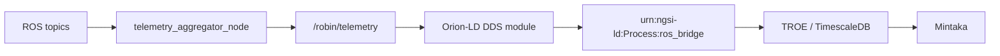

# ROS 2 DDS to NGSI-LD Architecture

This document describes the active telemetry ingestion path used by ROBIN.

## Baseline

ROBIN uses a DDS-first flow:

1. ROS topics are aggregated into a single telemetry message (`ProcessTelemetry`)
2. Orion-LD DDS module maps that topic into a `Process` entity attribute
3. TROE + Mintaka provide temporal history

Legacy HTTP NGSI bridge is not part of this architecture.

---

## Data Flow



---

## ROS Layer

### Telemetry message

- File: `vulcanexus_ws/src/robin_interfaces/msg/ProcessTelemetry.msg`
- Purpose: package geometry + machine + pose values into DDS-friendly primitive fields

### Aggregation node

- File: `vulcanexus_ws/src/robin_core_data/scripts/telemetry_aggregator_node.py`
- Publishes: `/robin/telemetry`
- Inputs: geometry, fronius/welder data, pose topics

---

## Orion DDS Mapping

Configuration file: `config-dds.json`

The mapping connects DDS topic `rt/robin/telemetry` to entity
`urn:ngsi-ld:Process:ros_bridge` with attribute `urn:robin:processTelemetry`.

See [Configuration Reference](reference/configuration.rst) for the full JSON
and environment variable details.

---

## Validation Steps

```bash
# 1) Verify telemetry topic exists
ros2 topic echo /robin/telemetry

# 2) Verify Orion process entity
curl -H "NGSILD-Tenant: robin" \
  "http://localhost:1026/ngsi-ld/v1/entities/urn:ngsi-ld:Process:ros_bridge"

# 3) Verify temporal history via Mintaka
curl -H "NGSILD-Tenant: robin" \
  "http://localhost:9090/temporal/entities/urn:ngsi-ld:Process:ros_bridge?lastN=5"
```

---

## Notes

- Keep ROS and Orion DDS domains aligned (`ROS_DOMAIN_ID`).
- Use host networking for DDS discovery where required by deployment.
- Prefer flat numeric fields in telemetry messages for robust DDS-to-NGSI mapping.

