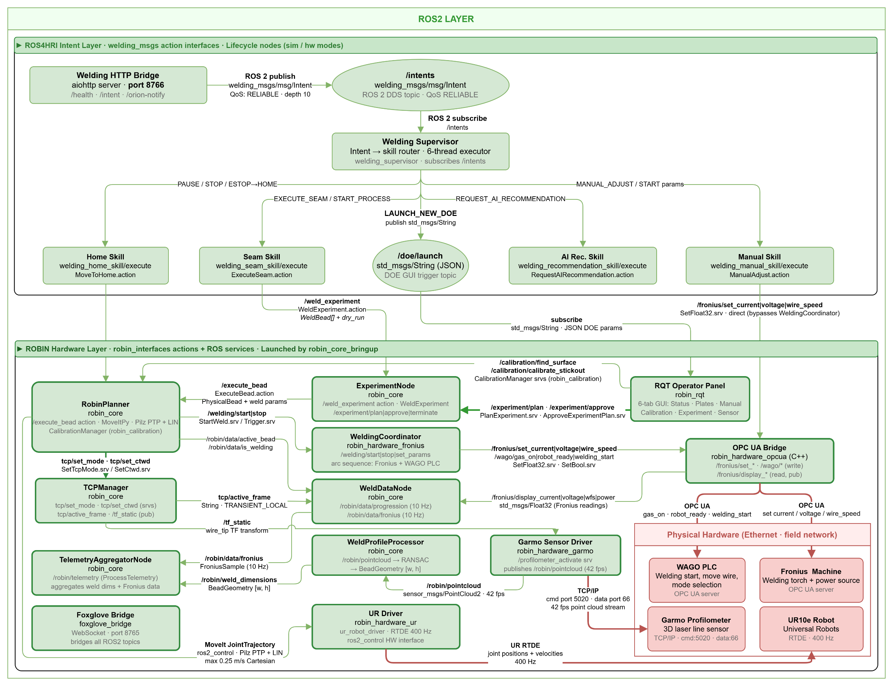
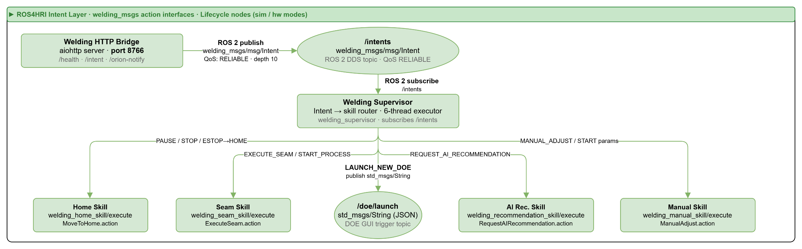
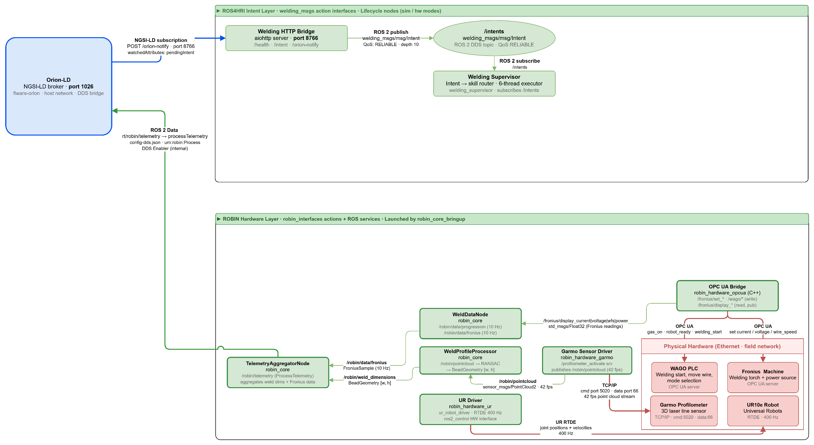

ROS4HRI Alignment
=================

This page explains how ROBIN aligns with the ROS4HRI concepts of operator **intent**,
**skill**, **task**, and **mission**.  It shows, for each operator action, the dashboard
control that triggers it, the API and ROS interfaces that carry it, the skill that runs
it, and where each part lives in the code.

Start with the :ref:`supported-action-mapping` table for the full picture, then use the
:ref:`implementation-evidence` section to find the matching files.

Scope
-----

ROBIN aligns with ROS4HRI through four explicit integration points:

* **Operator intents** - typed ``Intent`` values issued by an authorized operator.
* **Dashboard actions** - the Live Ops controls that emit those intents.
* **Profile-defined skills** - robot capabilities declared per domain in
  ``config/profiles/*.yaml`` and implemented as ROS 2 skill action servers.
* **ROS and API integration points** - the ``POST /intent`` endpoint, the
  process-control REST endpoints, and the ROS 2 ``/intents`` topic that connect them.

ROBIN is **not** a full human-robot interaction perception stack.  It does **not**
implement speech recognition, gesture recognition, human-pose estimation, or human
tracking, and it does not provide the ROS4HRI ``/humans`` perception layer.  The
``Intent`` message follows the ROS4HRI intent structure so the same routing would apply
if a perception front-end were added later, but today every intent comes from an explicit
dashboard control (a touchscreen or button press) or from an internal supervisor
decision.

User Roles
----------

ROBIN recognizes three operator-facing roles.  Role separation is organizational; it is
not enforced by authentication in this baseline.

Authorized dashboard operator
~~~~~~~~~~~~~~~~~~~~~~~~~~~~~~~

Issues operator intents through the Live Ops controls (start, pause, resume, stop,
abort / home, manual adjust, request AI recommendation).  Reviews deviation alerts and
**accepts, rejects, overrides, or adjusts** AI recommendations before any parameter is
applied.  Remains the final authority for every process decision.

Process engineer
~~~~~~~~~~~~~~~~~

Defines the process envelope: sets geometry targets and tolerance thresholds, chooses the
operation mode (``parameter_driven`` or ``geometry_driven``), and launches a new Design
of Experiments (DoE) campaign.  Reads telemetry, deviation history, and AI model evidence
to judge process quality.

Maintainer / integrator
~~~~~~~~~~~~~~~~~~~~~~~~~

Adapts ROBIN to a new domain or deployment: edits the profile YAML
(``config/profiles/``) to declare vocabulary, ROS 2 topics, and skills; wires skill
action servers to real hardware; and runs the stack with Docker Compose.

Intent, Skill, Task, and Mission Model
--------------------------------------

ROBIN uses the following terms consistently, in line with the ROS4HRI vocabulary:

* **Operator intent** - a typed value of ``welding_msgs/msg/Intent`` (for example
  ``START_PROCESS`` or ``MANUAL_ADJUST``).  The message follows
  ``hri_actions_msgs/msg/Intent`` and carries ``intent``, a JSON ``data`` payload, and
  the ``source``, ``modality``, ``priority``, and ``confidence`` fields.
* **Dashboard action** - the Live Ops control an operator presses to emit an intent.
  Each button maps to exactly one intent.
* **API equivalent** - the REST endpoint that carries the intent or its effect.
  ``POST /intent`` publishes an operator intent for the FIWARE-to-ROS 2 bridge, while the
  process-control endpoints (for example ``POST /process/{id}/stop``) apply the same
  effect directly.
* **ROS equivalent** - the ROS 2 ``/intents`` topic carrying a
  ``welding_msgs/msg/Intent`` message, consumed by the ``welding_supervisor``.
* **Skill** - a ROS 2 action server that implements one robot capability
  (a ``welding_*_skill`` package).  Skills are also declared per domain in the profile
  ``skills:`` block.
* **Task** - a single skill goal execution (one ``ExecuteSeam`` goal, one
  ``MoveToHome`` goal, and so on).
* **Mission** - a sequence of tasks orchestrated by the supervisor.  For example,
  ``Pause`` is a mission that cancels the active seam task and then runs a move-to-home
  task.

End to end, an intent travels this path:

.. code-block:: text

   Dashboard control
     -> POST /intent (Alert Engine)
       -> Orion-LD (NGSI-LD entity)
         -> DDS / notify bridge
           -> ROS 2 /intents topic (welding_msgs/msg/Intent)
             -> welding_supervisor (routes intent to a skill)
               -> welding_*_skill/execute (action goal = task)

.. _supported-action-mapping:

Supported Action Mapping
------------------------

.. list-table::
   :header-rows: 1
   :widths: 14 12 16 16 18 14 10

   * - User action / intent
     - Dashboard control
     - API equivalent
     - ROS equivalent
     - Skill / task / mission
     - Implementation evidence
     - Current status
   * - Start / execute (``START_PROCESS`` / ``EXECUTE_SEAM``)
     - Start
     - ``POST /intent``
     - ``/intents`` -> supervisor
     - ``welding_seam_skill/execute`` (ExecuteSeam) - task
     - ``LiveOps.tsx``; ``ExecuteSeam.action``; ``welding_seam_skill``
     - Implemented (sim + HW path)
   * - Pause (``PAUSE_PROCESS``)
     - Pause
     - ``POST /intent``
     - ``/intents`` -> supervisor
     - cancel seam + ``welding_home_skill/execute`` - mission
     - ``LiveOps.tsx``; ``Intent.msg``
     - Implemented
   * - Resume (``RESUME_PROCESS``)
     - Resume
     - ``POST /intent`` / ``POST /process/{id}/resume``
     - ``/intents`` -> supervisor
     - re-initiate seam - mission
     - ``LiveOps.tsx``; ``alert_engine.py``
     - Implemented
   * - Stop (``STOP_PROCESS``)
     - Stop
     - ``POST /intent`` / ``POST /process/{id}/stop``
     - ``/intents`` -> supervisor
     - cancel all + move home - mission
     - ``LiveOps.tsx``; ``alert_engine.py``
     - Implemented
   * - Abort / home / E-stop (``ESTOP`` / ``MOVE_TO_HOME``)
     - Abort
     - ``POST /intent``
     - ``/intents`` -> supervisor
     - ``welding_home_skill/execute`` (MoveToHome) - task
     - ``LiveOps.tsx``; ``MoveToHome.action``; ``welding_home_skill``; ``robin_core`` ``/move_home``
     - Implemented (MoveIt ``/move_home``)
   * - Manual adjustment (``MANUAL_ADJUST``)
     - Manual adjust
     - ``POST /intent`` / ``POST /process/{id}/input-params``
     - ``/intents`` -> supervisor
     - ``welding_manual_skill/execute`` (ManualAdjust) - task
     - ``ProcessControlsPanel.tsx``; ``ManualAdjust.action``; ``welding_manual_skill``
     - Implemented (Fronius services)
   * - Request AI recommendation (``REQUEST_AI_RECOMMENDATION``)
     - AI retry
     - ``POST /intent`` / ``POST /ai-recommendation``
     - ``/intents`` -> supervisor
     - ``welding_recommendation_skill/execute`` - task
     - ``DeviationMonitor.tsx``; ``RequestAIRecommendation.action``; ``welding_recommendation_skill``
     - Implemented (calls ``POST /ai-recommendation``)
   * - Launch new DoE (``LAUNCH_NEW_DOE``)
     - New DOE
     - ``POST /intent``
     - ``/intents`` -> supervisor
     - external GUI (not skill-mapped)
     - ``Intent.msg``
     - Partial / external

.. _implementation-evidence:

Implementation Evidence
-----------------------

Each behavior in the table is backed by concrete files, grouped by layer.

Dashboard controls
~~~~~~~~~~~~~~~~~~~

* ``robin-dashboard/src/components/features/live-ops/LiveOps.tsx`` - start, pause,
  resume, stop, abort controls.
* ``robin-dashboard/src/components/features/live-ops/ProcessControlsPanel.tsx`` - mode
  selection, parameter and target-geometry adjustment, apply settings.
* ``robin-dashboard/src/components/features/live-ops/DeviationMonitor.tsx`` - deviation
  alert actions, including manual adjust and request AI recommendation.

API endpoints (Alert Engine)
~~~~~~~~~~~~~~~~~~~~~~~~~~~~~~

Defined in ``robin/alert_engine.py``:

* ``POST /intent`` - publish an operator intent for the FIWARE-to-ROS 2 bridge.
* ``POST /process/{process_id}/stop`` / ``POST /process/{process_id}/resume`` - process
  lifecycle control.
* ``POST /process/{process_id}/mode`` - set ``parameter_driven`` / ``geometry_driven``.
* ``POST /process/{process_id}/input-params`` - update process parameters.
* ``POST /process/{process_id}/target`` - set geometry target.
* ``POST /ai-recommendation`` - request an advisory parameter recommendation.
* ``POST /check-deviation`` - evaluate geometry deviation and return operator options.

Profile-defined skills
~~~~~~~~~~~~~~~~~~~~~~~~

The ``skills:`` block of ``config/profiles/welding.yaml`` declares each robot capability
as a ROS 2 service or action, for example:

.. code-block:: yaml

   skills:
     start_process:
       ros_type: service
       ros_name: /welding/start
       srv_type: robin_interfaces/srv/StartWeld
       description: Start the welding arc
     run_experiment:
       ros_type: action
       ros_name: /weld_experiment
       action_type: robin_interfaces/action/WeldExperiment
       description: Execute a multi-bead welding experiment

ROS 2 messages, actions, and skill nodes
~~~~~~~~~~~~~~~~~~~~~~~~~~~~~~~~~~~~~~~~~~

* ``vulcanexus_ws/src/welding_msgs/msg/Intent.msg`` - intent message following
  ``hri_actions_msgs/msg/Intent``; defines all intent, source, and modality constants.
* ``vulcanexus_ws/src/welding_msgs/action/*.action`` - each action file declares its
  ROS4HRI mapping in a header comment:

  * ``ExecuteSeam.action`` - ``motion_skills/action/ExecuteCartesianTrajectory``
  * ``MoveToHome.action`` - ``motion_skills/action/ExecuteJointTrajectory``
  * ``ManualAdjust.action`` - ``process_skills/action/ManualParameterAdjust``
  * ``RequestAIRecommendation.action`` - ``ai_skills/action/RequestRecommendation``

* Skill action servers: ``vulcanexus_ws/src/welding_seam_skill``,
  ``welding_home_skill``, ``welding_manual_skill``, ``welding_recommendation_skill``.
* ``vulcanexus_ws/src/robin_core/robin_core/robin_planner_node.py`` - hosts the
  ``/move_home`` action server (MoveIt move to the SRDF ``home`` group state) that
  ``welding_home_skill`` delegates to, and the ``/execute_bead`` action server that
  ``welding_seam_skill`` delegates to; ``robin_core/robin_core/motion.py`` provides
  ``MotionPlanner.move_to_named_target``.

Launch and orchestration
~~~~~~~~~~~~~~~~~~~~~~~~~~

* ``vulcanexus_ws/src/robin_bringup/launch/robin_main.launch.py`` - brings up the
  skill nodes and supporting infrastructure.
* ``docker-compose.yaml`` - composes Orion-LD, the DDS bridge, the Vulcanexus ROS 2
  workspace, the Alert Engine, and the dashboard.
* ``docs/LAUNCH_AND_VERIFY_INTENTS.md`` - step-by-step guide to launch and verify the
  intent path end to end.

Architecture Diagrams
---------------------

The three diagrams below trace the same intent path, from the wide system view down to
the data bridge that carries each intent into ROS 2.  Read them top to bottom: the system
layer shows where the intent flow sits within ROBIN, the intent layer zooms into the
routing from dashboard control to skill, and the bridge flow shows the FIWARE-to-ROS 2
transport that connects the two.

System layer
~~~~~~~~~~~~~

The ROS 2 layer in context: the ROS4HRI-inspired intent flow, skill routing, and the
hardware interfaces that the skills ultimately drive.  This is where the operator intents
from the :ref:`supported-action-mapping` table enter the robot system.

   ROS 2 / ROS4HRI system layer: intent flow, skill routing, and ROBIN hardware
   interfaces.

Intent layer
~~~~~~~~~~~~~

A focused view of the intent routing: the dashboard intent bridge publishes onto
``/intents``, the ``welding_supervisor`` routes each ``Intent`` to the matching skill, and
the skill action servers run the resulting task.

   ROS4HRI intent layer: dashboard intent bridge, ``/intents``, supervisor routing, and
   skill action servers.

Bridge flow
~~~~~~~~~~~

The FIWARE-to-ROS 2 transport: how the ``POST /intent`` data stored in Orion-LD crosses
the DDS / notify bridge to reach the ROS 2 ``/intents`` topic and the intent layer above.

   Bridge flow connecting Orion-LD / DDS data with the ROS4HRI intent layer.

These diagrams are maintained alongside the other evidence under ``media/architecture/``;
see ``media/README.md`` for the full evidence index.

Current Limitations
-------------------

The following are the current gaps relative to a full ROS4HRI implementation:

* **No human perception layer.** Speech, gesture, human-pose, and human-tracking are
  not implemented, and the ROS4HRI ``/humans`` topics are absent.  The ``Intent`` schema
  reserves ``SPEECH`` and ``GESTURE`` modality constants, but only ``TOUCHSCREEN`` and
  ``INTERNAL`` modalities are wired today.
* **No formal ROS4HRI message packages.** ROBIN uses its own ``welding_msgs``
  package that follows the ROS4HRI structure rather than depending on ``hri_actions_msgs``
  or ``hri_msgs``.
* **Recommendation skill preconditions.** ``welding_recommendation_skill`` calls
  ``POST /ai-recommendation`` and therefore needs the process state the endpoint reads:
  a geometry target (``geometry_driven``) or current input parameters
  (``parameter_driven``) must already be set, otherwise the skill returns a failure.
* **DoE launch is external.** ``LAUNCH_NEW_DOE`` triggers an external configuration GUI
  and is not mapped to a skill action server.

**Human authority.** ROBIN provides monitoring, deviation detection, and AI-assisted
recommendations.  These recommendations are advisory: the human operator remains the
final authority for process decisions and can accept, reject, override, or adjust
recommendations before any action is taken.

For configuration and profile details, see :doc:`/reference/configuration`.  For the
overall data flow, see :doc:`/user_guide/overview`.
