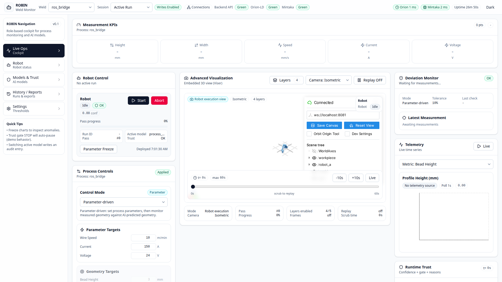

AI Models & Trust
=================

ROBIN uses a PyTorch MLP (``ProcessGeometryMLP``) to predict process geometry
from process parameters, or to suggest parameters for a target geometry.  Models
are managed through the dashboard and the REST API.

Model Control in the Dashboard
------------------------------

Navigate to the **Models & Trust** tab in the sidebar.

Active Model
~~~~~~~~~~~~

The top card shows the currently loaded checkpoint - name, file path, and size.
The model is loaded at startup from the path specified in the active profile's
``ai.model_path`` field.

Checkpoint Registry
~~~~~~~~~~~~~~~~~~~

All ``.pt`` files found under ``data/models/`` are listed with their size and
modification date.  Click **Load** to switch the active model at runtime.

Quick Prediction
~~~~~~~~~~~~~~~~

Enter the AI input values for the active profile, then click
**Predict Geometry** to run a forward pass and see predicted height and width
instantly. For the current welding profile, the inputs are wire feed speed,
travel speed, and arc length correction.

Model Routing
~~~~~~~~~~~~~

ROBIN supports position-based routing: assign different model checkpoints to
robot positions PA and PC.  This lets you run specialised models per station.

Trust Thresholds
~~~~~~~~~~~~~~~~

Set the **Warning** and **Stop** confidence levels.  When the runtime trust
score for a robot drops below a threshold, the corresponding safety gate fires:

* **Warning** - operator is alerted, robot continues
* **Stop** - robot pauses automatically

API Endpoints
-------------

.. list-table::
   :header-rows: 1
   :widths: 35 65

   * - Endpoint
     - Description
   * - ``GET /ai/models``
     - List all available model checkpoints
   * - ``GET /ai/models/active``
     - Get the currently loaded model
   * - ``POST /ai/models/select``
     - Load a specific checkpoint by path
   * - ``POST /ai/models/predict``
     - Run a forward prediction with the profile-defined AI input features

Training a New Model
--------------------

.. code-block:: bash

   python scripts/train_profile_model.py

This script:

1. Reads each profile's ``ai.feature_order`` and ``ai.model_path``
2. Generates synthetic training data using a profile-specific demo simulator
3. Trains a ``ProcessGeometryMLP`` network with the profile feature names baked
   into the checkpoint
4. Saves the checkpoint to the configured ``ai.model_path`` when that file is
   missing

Existing checkpoints are skipped by default so the command does not replace the
committed welding reference model. Use ``--profile <name>`` to train one profile
or ``--overwrite`` when intentionally replacing an existing checkpoint.

Model Architecture
------------------

``ProcessGeometryMLP`` maps 3 input features to 2 outputs:

* **Inputs**: 3 profile-defined AI inputs (order defined by ``ai.feature_order``
  in the profile YAML). For the welding profile these are
  ``wire_feed_speed_mpm_model_input``, ``travel_speed_mps_model_input``, and
  ``arc_length_correction_mm_model_input``.
* **Outputs**: predicted height, predicted width
* **Normalisation**: per-feature mean/std stored in the checkpoint
* **Configurable**: number of hidden layers, hidden size, dropout rate
