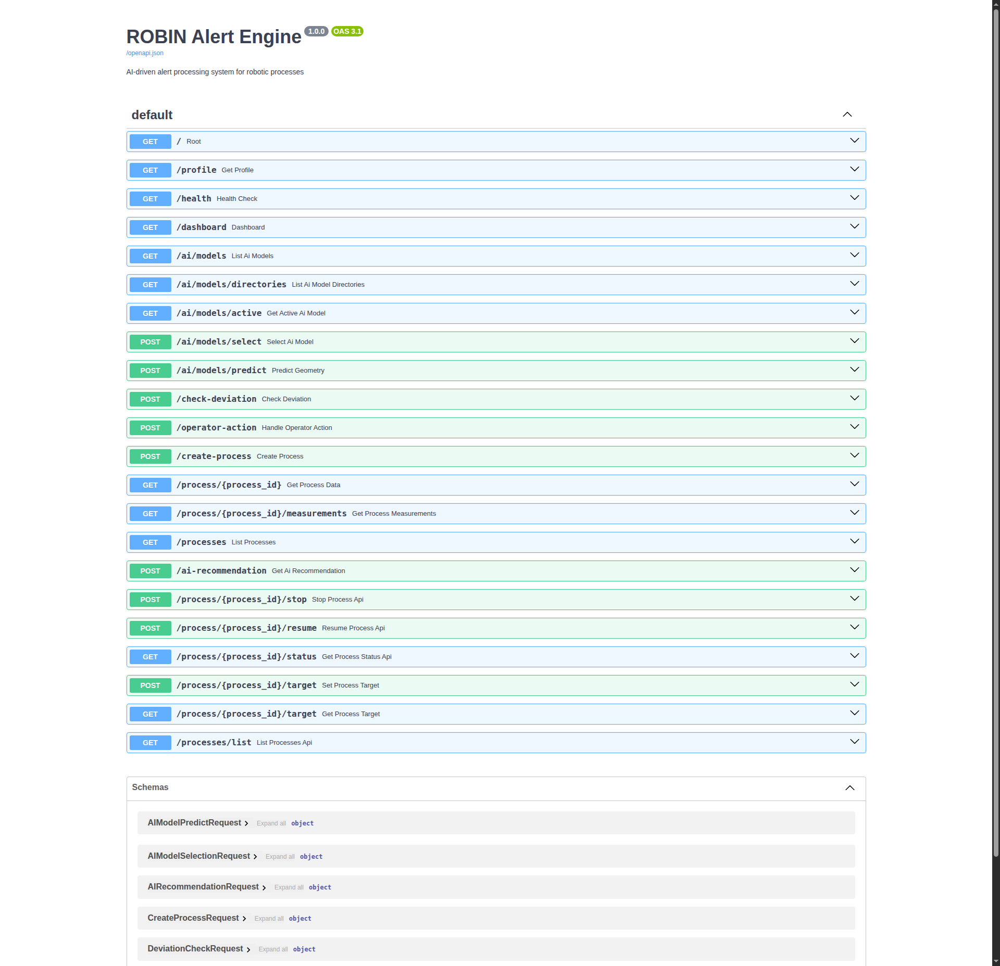

REST API & Process Lifecycle
============================

The Alert Engine exposes a REST API at http://localhost:8001 with interactive
Swagger documentation at http://localhost:8001/docs.

Endpoint Overview
-----------------

.. list-table::
   :header-rows: 1
   :widths: 25 30 45

   * - Category
     - Endpoints
     - What it does
   * - Process lifecycle
     - ``POST /create-process``, ``GET /processes``, ``stop``, ``resume``, ``POST /process/{id}/mode``
     - Create and manage manufacturing processes
   * - Measurements
     - ``GET /process/{id}/measurements``
     - Fetch time-series data via Mintaka or Orion fallback
   * - Alerts / warnings
     - ``GET /process/{id}/alerts``
     - Fetch persisted deviation warning events for history/report export
   * - AI models
     - ``GET /ai/models``, ``POST /ai/models/select``, ``POST /ai/models/predict``
     - List checkpoints, load a model, run forward predictions
   * - Deviation detection
     - ``POST /check-deviation``
     - Compare measured geometry against AI prediction or target
   * - Recommendations
     - ``POST /ai-recommendation``
     - Get AI-generated parameter or geometry suggestions
   * - Profile
     - ``GET /profile``
     - Active domain profile (vocabulary, fields, skills, AI config)
   * - Health
     - ``GET /health``
     - Service health check

Process Lifecycle
-----------------

Every manufacturing run is represented as a ``Process`` entity in Orion-LD.
The Alert Engine manages its lifecycle through the states below.

Process States
~~~~~~~~~~~~~~

.. list-table::
   :header-rows: 1
   :widths: 15 40 45

   * - Status
     - Meaning
     - Typical actions
   * - ``active``
     - Process is running; measurements are expected
     - monitor, check deviation, stop
   * - ``stopped``
     - Process intentionally stopped
     - resume, inspect history
   * - ``paused``
     - Temporary hold
     - resume, stop
   * - ``error``
     - Process or integration failure
     - investigate, resume / stop

CLI Commands
~~~~~~~~~~~~

.. code-block:: bash

   poetry run robin process-status demo-001

   poetry run robin list-processes

   poetry run robin stop-process demo-001 --reason "maintenance_required"

   poetry run robin resume-process demo-001

API Examples
~~~~~~~~~~~~

.. code-block:: bash

   # Stop a process
   curl -X POST "http://localhost:8001/process/demo-001/stop" \
     -H "Content-Type: application/json" \
     -d '{"reason":"operator_request"}'

   # Resume
   curl -X POST "http://localhost:8001/process/demo-001/resume"

   # Status
   curl "http://localhost:8001/process/demo-001/status"

   # List active processes
   curl "http://localhost:8001/processes/list?status_filter=active"

   # Fetch persisted warning events for a process
   curl "http://localhost:8001/process/demo-001/alerts"

   # Set operation mode explicitly
   curl -X POST "http://localhost:8001/process/demo-001/mode" \
     -H "Content-Type: application/json" \
     -d '{"mode":"geometry_driven"}'

Process Entity Fields
~~~~~~~~~~~~~~~~~~~~~

The ``urn:robin:Process`` entity carries lifecycle metadata:

* ``processStatus`` - current state
* ``startedAt`` / ``stoppedAt`` - ISO timestamps
* ``stopReason`` - why the process was stopped

.. code-block:: json

   {
     "processStatus": {"type": "Property", "value": "active"},
     "startedAt": {"type": "Property", "value": "2026-02-22T10:30:00Z"},
     "stoppedAt": {"type": "Property", "value": null},
     "stopReason": {"type": "Property", "value": null}
   }

Best Practices
~~~~~~~~~~~~~~

1. Use explicit stop reasons (``scheduled_maintenance``,
   ``quality_threshold_exceeded``, ``operator_intervention``).
2. Check status before issuing control actions.
3. Keep lifecycle events auditable through API logs and Orion state.

Troubleshooting
---------------

If process status appears inconsistent:

.. code-block:: bash

   curl http://localhost:8001/health

   curl -H "NGSILD-Tenant: robin" \
     "http://localhost:1026/ngsi-ld/v1/entities/urn:ngsi-ld:Process:demo-001"

See :doc:`/reference/troubleshooting` for more diagnostic steps.
