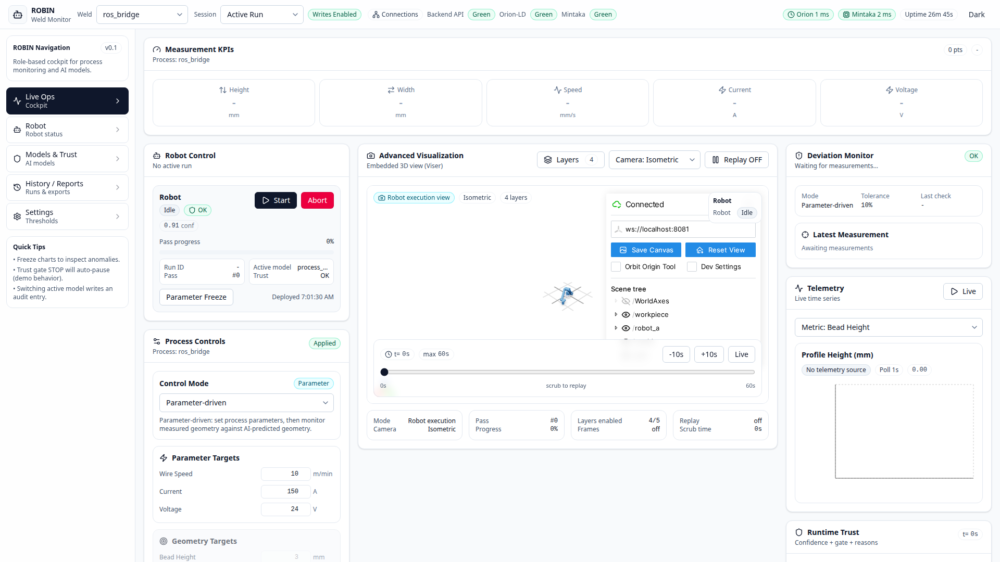
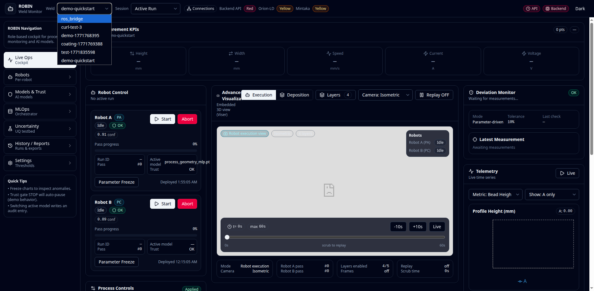

Operator Dashboard
==================

The ROBIN Dashboard is a React-based operator interface at
http://localhost:5174.  It connects to the Alert Engine API and provides
real-time monitoring, robot control, AI model management, and deviation
alerting - all configurable per domain profile.

Live Ops
--------

The **Live Ops** tab is the main cockpit.

Measurement KPIs
~~~~~~~~~~~~~~~~

The top row shows the latest values for the five core telemetry fields
(height, width, speed, current, voltage).  Labels and units adapt
automatically to the active :doc:`profile <profiles>`.

Robot Control
~~~~~~~~~~~~~

The left panel provides per-robot controls:

* **Start / Pause / Resume / Abort** - manage robot state
* **Parameter Freeze** - lock current parameters so the AI cannot override them
* **Active Model** - which AI checkpoint is loaded for this position
* **Trust Score** - runtime confidence with OK / Warning / Stop gate

3D Visualisation
~~~~~~~~~~~~~~~~

The centre panel embeds a `Viser <https://viser.studio/>`_ viewer (when a
Viser server is running) with toggleable layers:

* Robot model
* Tool path
* Workpiece
* Profile segments
* Coordinate frames

Camera presets (Isometric, Top, Front, Side) and a timeline scrubber are
available below the viewport.

Deviation Monitor
~~~~~~~~~~~~~~~~~

The right panel compares measured geometry against the AI prediction
(parameter-driven mode) or AI-guided geometry reference (geometry-driven mode):

* **Mode** - shows the active operation mode
* **Tolerance** - configurable percentage threshold
* **Latest Measurement** - last received height and width
* **Source** - shows whether the expected geometry comes from AI prediction or target fallback
* **Recommended actions** when a deviation fires: manual adjust, request new
  AI recommendation, add data for fine-tuning, or start a new DOE

Process Controls
~~~~~~~~~~~~~~~~

Below the deviation monitor, the **Process Controls** panel lets the operator:

* Switch between **parameter-driven** and **geometry-driven** modes
* Set tolerance percentage
* Enter process parameters (speed, current, voltage) or target geometry
  (height, width) depending on mode
* In geometry-driven mode, clicking **Apply Settings** stores target geometry
  and fetches AI-suggested parameters for the process

Telemetry Charts
~~~~~~~~~~~~~~~~

The bottom section shows live time-series powered by Recharts:

* Select metric: height, width, speed, current, or voltage
* Data source badge shows whether data is coming from **Mintaka stored data**
  or fallback source
* Poll cadence is 1-2 seconds depending on session mode
* X-axis uses elapsed time from measurement timestamps (stored temporal data)
* **Live** toggle for auto-scrolling and **Freeze Charts** to inspect windows

Models & Trust
--------------

The **Models & Trust** tab manages AI model checkpoints and trust settings.

See :doc:`ai_models` for a detailed walkthrough.

Other Tabs
----------

.. list-table::
   :header-rows: 1
   :widths: 25 75

   * - Tab
     - Purpose
   * - **Robots**
     - Per-robot detail cards with individual telemetry and controls
   * - **History / Reports**
     - Download CSV with all raw telemetry rows and persisted warning events (including raw JSON payload per row)
   * - **Settings**
     - Dark mode, trust thresholds, chart freeze, connection status

History CSV Workflow
--------------------

1. Open **History / Reports**.
2. Select the process ID in the dropdown.
3. Click **Refresh** to pull current stored telemetry + warnings.
4. Click **Download CSV**.
5. Verify CSV content:
   * ``record_type=measurement`` rows are raw telemetry samples.
   * ``record_type=warning`` rows are persisted deviation alerts.
   * ``raw_payload_json`` stores the exact backend payload for each row.

Top Bar
-------

The top bar (visible on every tab) provides:

* **Process selector** - switch between active processes
* **Session mode** - Active Run / Demo Mode
  * **Active Run**: process-control actions write to backend
  * **Demo Mode**: process-control actions are simulated locally (no backend write)
* **Connection indicators** - Backend API, Orion-LD, Mintaka from live
  ``GET /health`` probes (green / yellow / red)
* **Service latency chips** - Orion and Mintaka round-trip times in milliseconds
* **Backend uptime** - service uptime in hours from the Alert Engine health API
* **Dark mode** toggle
