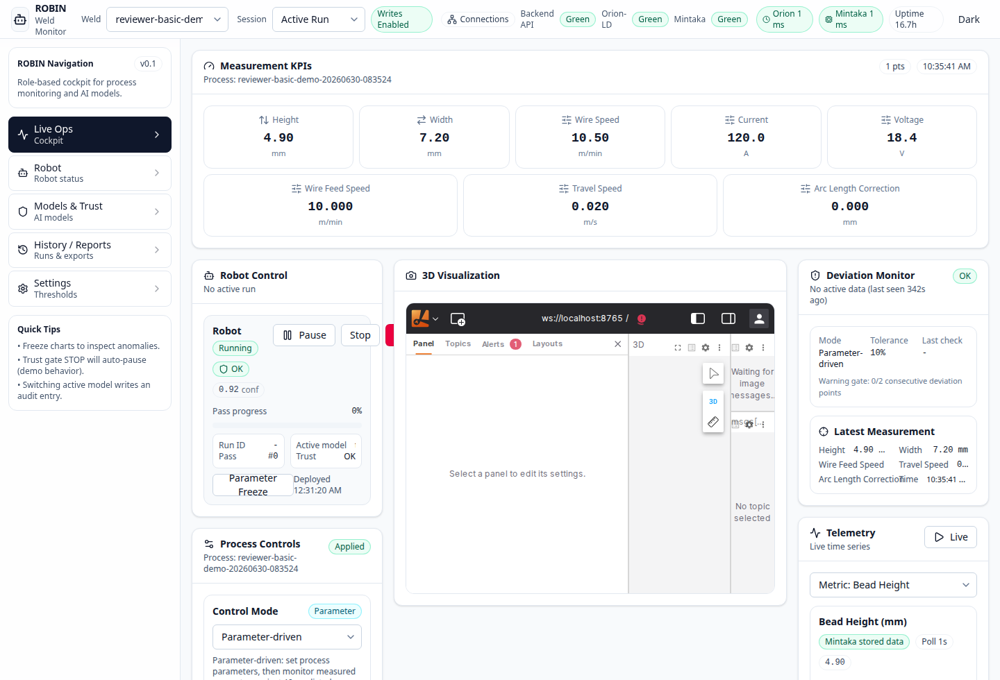

# Basic No-Hardware Demo Evidence

This folder contains visual evidence for the basic no-hardware demo documented
in [`../../docs/quickstart.rst`](../../docs/quickstart.rst). It is separate
from the physical ROBIN welding-cell demonstrator media.

Capture details:

- Profile: `welding`
- Process ID: `reviewer-basic-demo-20260630-083524`
- Captured: `2026-06-30T08:35Z`
- Hardware: none; Docker FIWARE/API/dashboard stack only

## Command And Output Evidence

### 1. Health Check

```bash
curl -s http://localhost:8001/health | jq '.status'
```

Expected output:

```text
"healthy"
```

The captured health response had `orion_connected=true` and
`mintaka_connected=true`.

### 2. Create Process

```bash
docker exec robin-alert-processor \
    python -m robin create-process reviewer-basic-demo-20260630-083524 \
    --mode parameter_driven
```

Captured output:

```text
Created process: reviewer-basic-demo-20260630-083524 (mode: parameter_driven)
```

### 3. Add One Measurement

```bash
docker exec robin-alert-processor \
    python -m robin add-measurement \
    reviewer-basic-demo-20260630-083524 \
    reviewer-basic-demo-20260630-083524-m001 \
    4.9 7.2 \
    --speed 10.5 \
    --current 120 \
    --voltage 18.4 \
    --input-param wire_feed_speed_mpm_model_input=10.0 \
    --input-param travel_speed_mps_model_input=0.020 \
    --input-param arc_length_correction_mm_model_input=0.0
```

Captured output:

```text
Added measurement reviewer-basic-demo-20260630-083524-m001 for process reviewer-basic-demo-20260630-083524: 4.9x7.2mm (speed=10.5mm/s, current=120.0A, voltage=18.4V)
```

### 4. Read Measurement Back

```bash
curl -s "http://localhost:8001/process/reviewer-basic-demo-20260630-083524/measurements?last=5" \
    | jq '{status, count, source: .debug_info.source, first: .measurements[0]}'
```

Captured output:

```json
{
  "status": "success",
  "count": 1,
  "source": "mintaka",
  "first": {
    "timestamp": "2026-06-30T08:35:41.818600Z",
    "height": 4.9,
    "width": 7.2,
    "speed": 10.5,
    "current": 120.0,
    "voltage": 18.4,
    "input_params": {
      "wire_feed_speed_mpm_model_input": 10.0,
      "travel_speed_mps_model_input": 0.02,
      "arc_length_correction_mm_model_input": 0.0
    }
  }
}
```

### 5. Request AI Recommendation

```bash
curl -s -X POST http://localhost:8001/ai-recommendation \
    -H "Content-Type: application/json" \
    -d '{
      "process_id": "reviewer-basic-demo-20260630-083524",
      "mode": "parameter_driven",
      "input_params": {
        "wire_feed_speed_mpm_model_input": 10.0,
        "travel_speed_mps_model_input": 0.020,
        "arc_length_correction_mm_model_input": 0.0
      }
    }' | jq '{status, mode: .recommendation.mode, prediction: .recommendation.predicted_geometry}'
```

Captured output:

```json
{
  "status": "success",
  "mode": "parameter_driven",
  "prediction": {
    "height": 1.8534595966339111,
    "width": 4.765771389007568
  }
}
```

## Visual Evidence

| Evidence | File |
| --- | --- |
| Dashboard Live Ops view with the basic-demo process selected and one measurement visible | [screenshots/basic-demo-dashboard-live-ops.png](screenshots/basic-demo-dashboard-live-ops.png) |
| API measurement read-back output | [screenshots/basic-demo-api-measurement-readback.png](screenshots/basic-demo-api-measurement-readback.png) |
| AI recommendation output | [screenshots/basic-demo-ai-recommendation.png](screenshots/basic-demo-ai-recommendation.png) |


