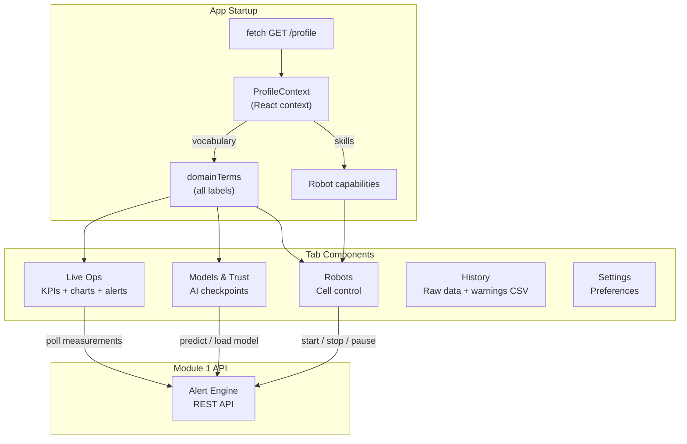

# Module 2 - ROBIN Dashboard

A React operator dashboard for live process monitoring, deviation alerts, AI model
management, and 3D visualization. All domain-specific labels are configurable via
environment variables - switch from welding to spray coating to machining without
touching the code.

## Interface Contract

**Requires:**
- Module 1 (Process Intelligence API) at `VITE_ROBIN_API_URL`

**Provides:**
- Browser UI at port 80 (mapped to 5174 in the integration example)

## Architecture



## Tabs

| Tab | Purpose |
|---|---|
| **Live Ops** | KPI cards, telemetry time-series chart, deviation monitor, process controls, 3D visualization |
| **Models & Trust** | AI model checkpoint management, quick predictions, trust thresholds |
| **History** | Download CSV report with all raw telemetry rows + persisted warning events for selected process |
| **Robots** | Robot cell status and control |
| **Settings** | Dark mode, trust thresholds, connection status |

## Dual Operational Modes In UI

The **Process Controls** and **Deviation Monitor** implement two distinct flows:

- **Parameter-driven**:
  - operator applies process parameters,
  - backend/AI predicts geometry from those parameters,
  - deviation monitor compares measured geometry vs AI prediction.
- **Geometry-driven**:
  - operator applies geometry targets,
  - backend fetches AI-suggested parameters for that target,
  - deviation monitor compares measured geometry vs expected geometry from AI-guided settings
    (or target fallback when needed).

Mode selection is persisted to backend (`POST /process/{id}/mode`).

## Top Bar Semantics

- **Session**
  - `Active Run`: control actions (`start/pause/resume/abort`, apply process controls) are sent to backend.
  - `Demo Mode`: control actions are simulated locally; backend writes are intentionally disabled.
- **Connections**
  - `Backend API`, `Orion-LD`, and `Mintaka` status come from live `GET /health` probes.
- **Latency chips**
  - Orion and Mintaka RTT values (ms) are rendered from health payload fields.

## Telemetry Data Path

- The Live Ops telemetry panel polls `/process/{id}/measurements` every 1-2 seconds.
- The panel explicitly shows source state:
  - `Mintaka stored data` when temporal data comes from Mintaka.
  - `Orion fallback data` only if Mintaka has no series for that process.
- Chart x-axis is derived from measurement timestamps (elapsed seconds), not sample index.

## History Report CSV

- The History tab fetches:
  - `/process/{id}/measurements` for raw telemetry rows (Mintaka first, Orion fallback).
  - `/process/{id}/alerts` for persisted deviation warning events.
- Export produces one CSV containing both row types with a `record_type` column:
  - `measurement`
  - `warning`
- CSV includes flattened columns for key telemetry/alert fields plus:
  - `alert_id` for persisted warning entities.
  - `raw_payload_json` with the full raw object returned by the API for each row.

### Operator workflow

1. Open **History / Reports** in the dashboard.
2. Select the process in the process dropdown.
3. Click **Refresh** to fetch latest stored measurements and warning events.
4. Click **Download CSV**.
5. Validate contents:
   - `record_type=measurement` rows contain raw telemetry fields.
   - `record_type=warning` rows contain deviation/warning fields.
   - `raw_payload_json` contains the exact API payload per row.

## Domain Vocabulary

The dashboard loads its vocabulary **at runtime** from the API (`GET /profile`), which
reads a profile YAML file. No rebuild is needed to switch domains - one Docker image
serves all profiles.

The profile YAML's `vocabulary` section controls all domain-specific labels
(process, speed, current, voltage, height, width, tool path, workpiece, etc.).
See `config/profiles/welding.yaml` for a complete example.

`VITE_TERM_*` build-time environment variables are still supported as a fallback
if the API is unreachable.

## Deployment

**As a container (recommended):**

```bash
docker build -t robin-dashboard \
  --build-arg VITE_ROBIN_API_URL=http://your-api:8001 \
  robin-dashboard/
docker run -p 5174:80 robin-dashboard
```

**For development:**

```bash
cd robin-dashboard
npm ci
npm run dev
```

## Tech Stack

React 19, Vite, TypeScript, Tailwind CSS, Recharts, Lucide icons.
Production build is served by Nginx Alpine.
