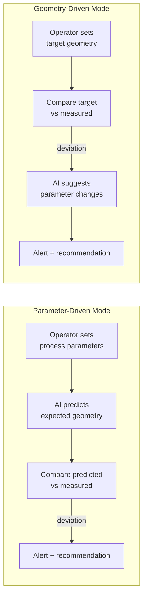
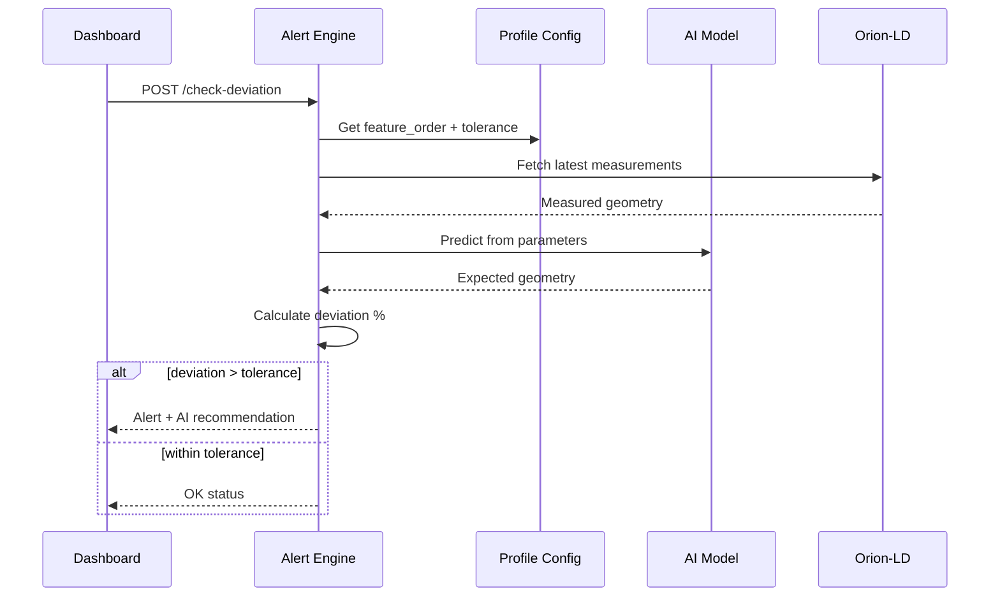

# Module 1 - Process Intelligence API

A FastAPI service and CLI for process lifecycle management, deviation detection,
and AI-assisted parameter recommendations. This module sits on top of any
FIWARE/Orion-LD deployment and provides the intelligence layer for robotic
process monitoring.

## Interface Contract

**Requires:**
- Orion-LD context broker (NGSI-LD API on port 1026)
- Mintaka temporal API (optional, for historical queries)

**Provides (REST API on port 8001):**

| Endpoint | Method | Purpose |
|---|---|---|
| `/health` | GET | Service health check |
| `/create-process` | POST | Create a new process entity |
| `/process/{id}` | GET | Get process state and latest measurements |
| `/process/{id}/measurements` | GET | Historical measurement data |
| `/process/{id}/alerts` | GET | Historical warning/alert data for reports |
| `/check-deviation` | POST | Compare measured geometry against expectations |
| `/ai-recommendation` | POST | Get AI parameter recommendations |
| `/operator-action` | POST | Record operator decisions (accept/reject/override) |
| `/docs` | GET | Interactive Swagger documentation |

**Provides (CLI):**

```bash
robin status                    # Check connectivity
robin create-process <id>       # Create process
robin add-measurement <id> ...  # Add measurement data
robin add-recommendation <id> . # Add AI recommendation
robin create-target <id> h w    # Set geometry target
robin serve                     # Start the API server
```

## Data Model

The module captures a pattern common to many manufacturing processes -
**geometry outputs** and **process inputs**:

| Field | Role | Example mappings |
|---|---|---|
| `measuredHeight` | Primary geometry output | bead height, coating thickness, layer height |
| `measuredWidth` | Secondary geometry output | bead width, coverage width, track width |
| `measuredSpeed` | Process speed | wire speed, line speed, feed rate |
| `measuredCurrent` | Primary process input | welding current, flow rate, spindle load |
| `measuredVoltage` | Secondary process input | arc voltage, nozzle pressure, tool force |

Domain-specific names are applied by **profiles** (see `demo/profiles/`).
The module itself is domain-agnostic.

## Operation Modes



- **Parameter-driven** - AI predicts expected geometry from process parameters, alerts on deviations
- **Geometry-driven** - operator sets target geometry, system monitors actual vs. target

## AI Model Framework (`ai/`)

- PyTorch MLP: 3 process inputs → 2 geometry outputs
- Configurable architecture (hidden layers, activation)
- Per-profile model checkpoints (`data/models/<profile>/process_geometry_mlp.pt`)
- Feature normalization baked into each checkpoint
- Model checkpointing and versioning
- Trust scoring for operator confidence

The active model is determined by `ai.model_path` in the profile YAML. Train new
models with `scripts/train_profile_model.py`.

## Request Flow: Deviation Check



## Files

| File | Purpose |
|---|---|
| `alert_engine.py` | FastAPI service: deviation detection, AI recommendations, operator actions, dashboard API |
| `cli.py` | Typer CLI client and FIWARE entity management |
| `ai/mlp.py` | Neural network model definition |
| `ai/__init__.py` | Model loading/saving utilities |
| `Dockerfile` | Container packaging |

## Deployment

**As a container (recommended):**

```bash
docker build -t robin-api -f robin/Dockerfile .
docker run -p 8001:8000 -e MINTAKA_URL=http://mintaka:8080 robin-api
```

**From source:**

```bash
poetry install
poetry run robin serve
```
