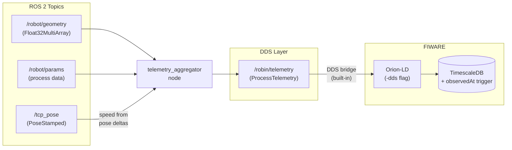

# Integration Pattern - ROS 2 to FIWARE via DDS

This package is part of the **ROS 2 → FIWARE integration pattern**, not a standalone
module. It provides a telemetry aggregator node and works together with Orion-LD's
built-in DDS bridge to get robot data into FIWARE without custom bridge code.

## What ROBIN Contributes

| Component | Location | What it does |
|---|---|---|
| Telemetry aggregator node | `scripts/telemetry_aggregator_node.py` | Merges heterogeneous ROS topics into one normalized message |
| Message schema | `robin_interfaces/msg/ProcessTelemetry.msg` | Generic telemetry message definition |
| DDS mapping config | `config-dds.json` (repo root) | Tells Orion-LD which DDS topic maps to which NGSI-LD entity |
| Temporal support | `db/init/` SQL scripts | TimescaleDB trigger for correct `observedAt` timestamps from DDS data |

The actual DDS-to-NGSI-LD bridge is **Orion-LD's built-in feature** (the `-dds` flag).

## Pipeline



## telemetry_aggregator_node.py

Subscribes to configurable ROS topics and publishes a unified `ProcessTelemetry`
message on `/robin/telemetry`.

**Parameters:**

| Parameter | Default | Purpose |
|---|---|---|
| `geometry_topic` | `/robin/weld_dimensions` | Source topic for geometry measurements |
| `fronius_topic` | `/robin/data/fronius` | Source topic for process parameters |
| `pose_topic` | `/tcp_pose_broadcaster/pose` | Source topic for robot TCP pose |
| `output_topic` | `/robin/telemetry` | Normalized output topic |
| `min_publish_period` | `0.1` | Minimum seconds between publishes |

**Usage:**

```bash
ros2 run robin_core_data telemetry_aggregator_node.py --ros-args \
  -p geometry_topic:=/my_sensor/dimensions \
  -p fronius_topic:=/my_machine/parameters \
  -p pose_topic:=/tcp_pose \
  -p output_topic:=/robin/telemetry
```

## Also in this Package (Example Adapter)

| Node | Layer | Purpose |
|---|---|---|
| `telemetry_aggregator_node.py` | **Integration pattern** (reusable) | Generic topic aggregation |
| `weld_data_node.py` | **Example adapter** (welding-specific) | Progression tracking for welding data |

The `weld_data_node` demonstrates how a domain-specific adapter can add value on
top of the generic pipeline. It is not part of the reusable components.

## Deployment

```bash
cd vulcanexus_ws
colcon build --packages-select robin_interfaces robin_core_data
source install/setup.bash
ros2 run robin_core_data telemetry_aggregator_node.py
```
